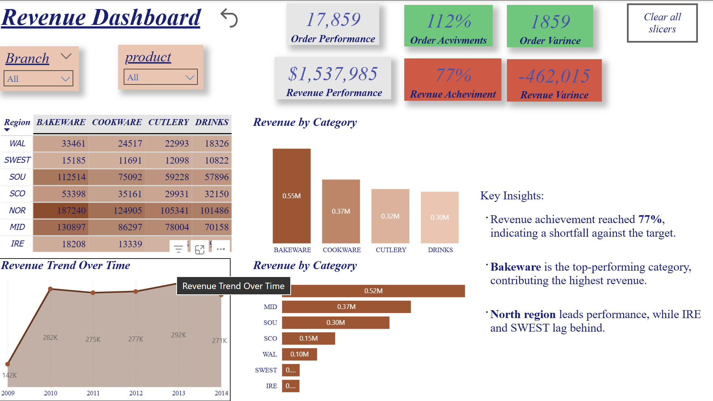

# Revenue Performance Dashboard | Power BI

This project presents an interactive Revenue Performance Dashboard built using Power BI,
designed to monitor business performance against predefined targets and support data-driven decision-making.
Key Features:

Revenue & Orders KPIs with targets, variance, and achievement percentages

Dynamic analysis by Region and Product Category

Automated conditional formatting for performance indicators

Revenue trend analysis over time

Clear insights highlighting performance gaps and top contributors

Key Insights:

Revenue achievement reached 77%, indicating a shortfall against the target.

Bakeware is the top-performing category, contributing the highest revenue.

North region leads overall performance, while IRE and SWEST lag behind.

Tools & Skills Used:

Power BI

DAX Measures

KPI Design & Target Tracking

Data Visualization

Business Insights & Performance Analysis
